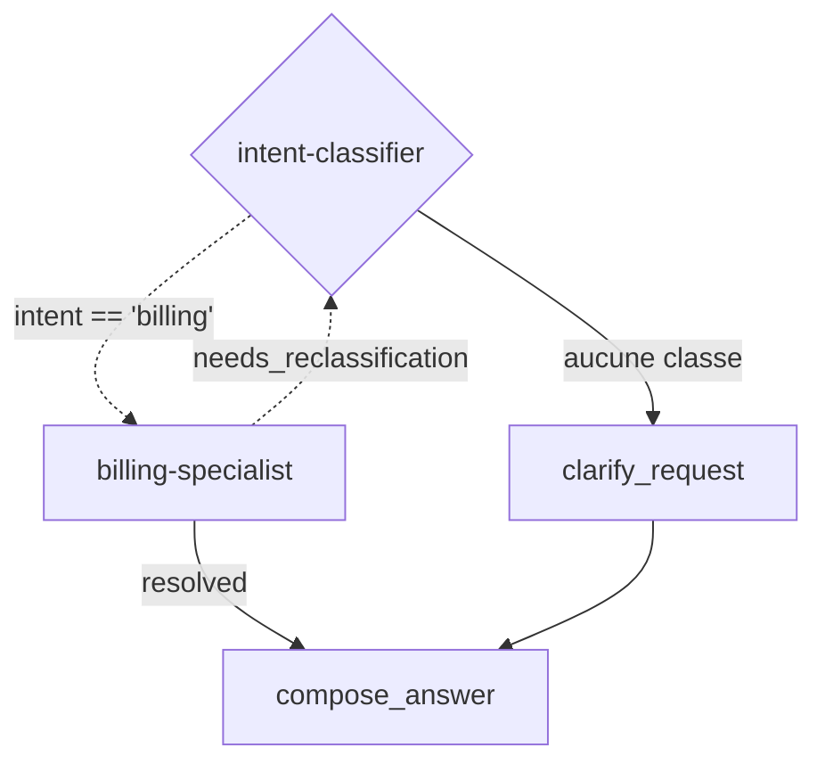

# TOPOLOGY: 1-SupportAssistant

MISSION: 1-SupportAssistant
MISSION hash: sha256:5a983251
Status: Draft
Root Pattern: router

---

## 1. Allocation des capabilities

| CAP | Portée par | Pourquoi là et pas ailleurs |
|---|---|---|
| 1-1-ClassifyIntent | agent `intent-classifier` | jugement sur du langage naturel, liste close d'intentions |
| 1-2-ExplainInvoiceLine | agent `billing-specialist` | rédaction fondée sur des documents récupérés |

---

## 2. Roster déclaré

### 2.1 Orchestrateur

- **id** : `intent-classifier`
- **rôle** : classe l'intention entrante et route vers le spécialiste adéquat
- **responsabilités** : router ou demander une clarification ; ne répond jamais au fond
- **tier** : fast
- **outils** : aucun
- **règles d'orchestration** : route si confidence >= 0.7, sinon clarification ; maxHops = 6

### 2.2 Subagents

| id | rôle | responsabilités | outils / skills | tier | modèle |
|---|---|---|---|---|---|
| `billing-specialist` | répond aux questions de facturation | explique une ligne de facture à partir des documents récupérés ; n'émet jamais de remboursement | `invoice_lookup`, `zendesk_create_ticket` | balanced | |

### 2.3 Relations entre agents

| De | Vers | Condition | Compte comme hop |
|---|---|---|---|
| `intent-classifier` | `billing-specialist` | `intent == 'billing' && confidence >= 0.7` | oui |
| `intent-classifier` | `clarify_request` | aucune classe au-dessus du seuil — chemin de repli | oui |
| `billing-specialist` | `intent-classifier` | `needs_reclassification` | oui |

### 2.4 Bornes de boucle

| Boucle | Borne | Comportement à l'atteinte |
|---|---|---|
| `intent-classifier ↔ billing-specialist` | maxHops = 6 | `fail-explicit` avec l'état partiel |

---

## 3. Alternative plus simple considérée

**Topologie envisagée à N-1 agents** :
Un seul agent `balanced` portant la classification et l'explication, avec les
deux outils et le retriever.

**Ce qui la disqualifie** :
La classification représente 100 % des appels mais 30 % du coût en `balanced` ;
en `fast` elle coûte 8 fois moins pour une accuracy mesurée identique (0.96 vs 0.96
sur routing-v1).

| Agent | Raison invoquée | Élément de preuve |
|---|---|---|
| `billing-specialist` | tier distinct | classification à `fast` vs rédaction à `balanced`, économie mesurée $0.012/run |

---

## 4. Le graphe

Le graphe ci-dessous est compilé dans l'IR ; il n'existe nulle part ailleurs.

- **Nœud d'entrée** : `classify`
- **Nœuds terminaux** : `finalize`
- **maxHops** : `6`
- **Cycles** : `classify -> billing -> classify` (re-classification), coupé par maxHops = 6
- **Chemin de repli** : `aucune classe` -> `clarify_request`, réponse de clarification sans routage

---

## 5. Budget estimé

> Calculé par `estimate_budget.py`.

---

## 6. Contrats produits

| Type | Fichier |
|---|---|
| agent | `workspace/pipeline/contracts/agents/1-intent-classifier.agent.md` |
| agent | `workspace/pipeline/contracts/agents/1-billing-specialist.agent.md` |
| tool | `workspace/pipeline/contracts/tools/1-invoice-lookup.tool.md` |
| tool | `workspace/pipeline/contracts/tools/1-zendesk-create-ticket.tool.md` |
| retrieval | `workspace/pipeline/contracts/retrieval/1-contracts-index.retrieval.md` |

---

## 7. Handoffs

| De | Vers | Condition | État transmis | Retour attendu |
|---|---|---|---|---|
| `classify` | `billing` | `intent == 'billing'` | `{question, customer_id}` | `{answer, citations[], resolved: bool}` |
| `billing` | `classify` | `needs_reclassification` | `{question, hint}` | `{intent}` |

---

## 8. Imbrication de patterns

- Racine : `router`
- Imbriqué : aucun

---

## 9. Décisions à ADR

- ADR-20260920T1000-router-over-single: routeur fast + spécialiste balanced
