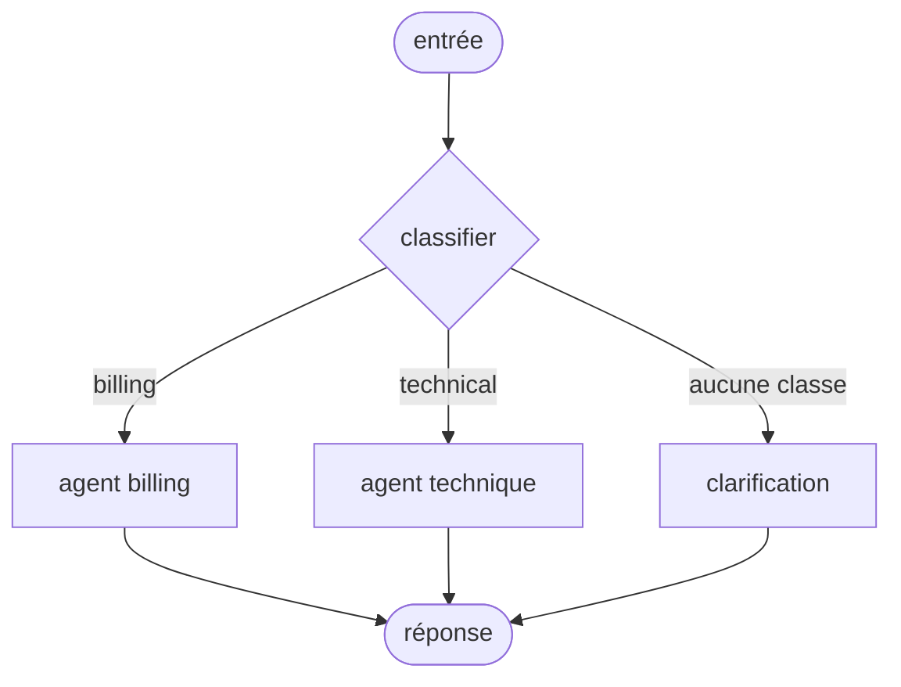

# TOPOLOGY: {n}-{MissionName}

MISSION: {n}-{MissionName}
MISSION hash: sha256:{mission-hash-8}
Status: Draft
Root Pattern: <single-agent | router | sequential | parallel | supervisor | graph | plan-execute | reflection | blackboard>

---

## 1. Allocation des capabilities

| CAP | Portée par | Pourquoi là et pas ailleurs |
|---|---|---|
| {n}-1-… | outil `…` | déterministe — aucun jugement requis |
| {n}-2-… | agent `…` | jugement sur du langage naturel |
| {n}-3-… | retriever `…` | récupération pure |

> Rappel : **un outil déterministe bat un agent sur tous les critères** — coût,
> latence, testabilité, débogabilité. Pour chaque CAP confiée à un agent,
> l'absence d'alternative outil doit être un constat, pas un oubli.

---

## 2. Roster déclaré

> **Section obligatoire, écrite par l'ARCHITECTE (P7).** C'est elle qui fixe
> l'architecture. Aucun agent n'est ajouté, retiré, renommé ni re-scopé par un
> LLM : le framework vérifie que cette section est complète pour le pattern
> choisi dans `STACK.md`, et refuse de générer sinon
> (`[ARCH_SPEC_INCOMPLETE]`, bloquant en G2).
>
> Ce qui est exigé dépend du pattern actif — voir
> `.sdda/registry/architecture-requirements.yml`. Contrôle sans token :
> `python .sdda/sdda.py validate-architecture --mission {n}`

### 2.1 Orchestrateur

- **id** : `<snake_case ou kebab-case, ex. support-orchestrator>`
- **rôle** : <une phrase : ce qu'il fait, et ce qu'il ne fait pas>
- **responsabilités** : <ce dont il répond ; ce qu'il délègue>
- **tier** : <fast | balanced | deep>
- **modèle** : <optionnel — un identifiant nominatif s'il doit primer sur le tier>
- **outils** : <liste, ou `aucun` explicitement>
- **règles d'orchestration** : <à qui il délègue, dans quel ordre, avec quelle borne>

### 2.2 Subagents

> Une ligne par agent. `outils / skills` accepte `aucun`, jamais un vide.
> Pour `single-agent`, cette table est vide — et c'est une déclaration, pas un oubli.

| id | rôle | responsabilités | outils / skills | tier | modèle |
|---|---|---|---|---|---|
| `billing-specialist` | répond sur la facturation | explique une ligne de facture, jamais un remboursement | `invoice_lookup`, `crm_customer_lookup` | deep | claude-opus-5 |
| `intent-classifier` | classe l'intention entrante | route ou demande une clarification, ne répond jamais au fond | aucun | fast | claude-haiku-4-5 |

### 2.3 Relations entre agents

> La condition est **explicite**. « Le contexte suit » n'est pas une condition,
> et un handoff sans état transmis est `[HANDOFF_UNCONTRACTED]` (§7).

| De | Vers | Condition | Compte comme hop |
|---|---|---|---|
| `support-orchestrator` | `billing-specialist` | `intent == 'billing' && confidence >= 0.7` | oui |
| `support-orchestrator` | `clarify` | aucune classe au-dessus du seuil — **chemin de repli** | oui |
| `billing-specialist` | `support-orchestrator` | réponse produite | oui |

### 2.4 Bornes de boucle

> Obligatoire dès que le pattern autorise un cycle (`supervisor`, `graph`,
> `plan-execute`, `reflection`, `blackboard`, `network`). Un cycle sans borne
> déclarée est une erreur bloquante, pas un avertissement (P12).

| Boucle | Borne | Comportement à l'atteinte |
|---|---|---|
| `orchestrateur ↔ specialists` | maxHops = 4 | `fail-explicit` avec l'état partiel |

### 2.5 Stratégie de fusion

> Obligatoire pour `parallel` uniquement. Réconcilier des sorties
> contradictoires est le vrai travail, et il s'évalue séparément.

<vote majoritaire | priorité déclarée | synthèse par un agent dédié | échec si divergence>

---

## 3. Alternative plus simple considérée

> **Section consultative.** Le framework signale une topologie au-delà d'un
> agent dont les raisons ne figurent pas dans la liste close de P7
> (`[TOPOLOGY_SIMPLICITY_ADVISORY]`, avertissement). Il ne refuse pas :
> l'architecture appartient à l'architecte. Cette section existe pour que le
> choix soit **écrit**, pas pour qu'il soit négocié.

**Topologie envisagée à N-1 agents** :
<décrire la topologie plus simple réellement considérée, ou « aucune » et pourquoi>

**Ce qui la disqualifie** :
<le critère PRÉCIS, avec sa mesure quand elle existe>

**Raison invoquée par agent au-delà du premier** — une raison de la liste close
de P7 :

| Agent | Raison invoquée | Élément de preuve |
|---|---|---|
| `…` | isolation de scope d'outils | il porte `delete_record`, incompatible avec un contexte exposé à du texte non maîtrisé |
| `…` | tier distinct | classification à `fast` vs rédaction à `deep`, économie estimée $0.02/run |
| `…` | pression de contexte | mesurée : 34k tokens de prompt combiné, au-dessus du confort |
| `…` | fonction objectif différente | un critique ne peut pas être le rédacteur qu'il note |
| `…` | parallélisme requis | 3 recherches indépendantes, latence contrainte à 8 s |

> « Séparation des responsabilités » n'est pas recevable.

---

## 4. Le graphe

> Le bloc ci-dessous EST le graphe : c'est lui que `ir-compiler` lit, et son
> hash est celui de ce fichier. Aucun fichier `.mmd` à côté — deux artefacts
> pour un graphe, c'est celui que personne ne relit qui gouverne l'IR.

- **Nœud d'entrée** : `…`
- **Nœuds terminaux** : `…`
- **maxHops** : `…`
- **Cycles** : <lister chaque cycle et la borne qui le coupe. Un cycle non borné
  est une erreur bloquante, pas un avertissement (P12)>
- **Chemin de repli** : <le cas « aucune branche ne correspond » — obligatoire
  pour tout routeur, sinon `[ROUTER_NO_FALLBACK]`>

---

## 5. Budget estimé

> Calculé sur le graphe par `estimate_budget.py`, pas estimé à la main.
> Comparé au budget déclaré dans la MISSION. Dépassement = G2 rouge.

| Chemin | Appels LLM | Tokens estimés | Coût estimé | Latence estimée |
|---|---:|---:|---:|---:|
| nominal (routage direct) | 2 | 6 500 | $0.021 | 3.1 s |
| avec retrieval | 3 | 14 000 | $0.044 | 5.8 s |
| pire cas (maxHops atteint) | 9 | 41 000 | $0.148 | 14.2 s |

- Budget MISSION : cible **$0.05** / plafond dur **$0.25** / p95 **8 000 ms**
- Verdict : <🟢 sous budget | 🟡 pire cas proche du plafond | 🔴 dépassement>
- **Si le pire cas dépasse le p95 cible** : dire quelle borne le ramène, ou
  changer de topologie. Ne pas espérer que le pire cas soit rare.

---

## 6. Contrats produits

| Type | Fichier |
|---|---|
| agent | `workspace/feats/contracts/agents/{n}-{agent}.agent.md` |
| tool | `workspace/feats/contracts/tools/{n}-{tool}.tool.md` |
| retrieval | `workspace/feats/contracts/retrieval/{n}-{index}.retrieval.md` |
| memory | `workspace/feats/contracts/memory/{n}-memory.md` |

---

## 7. Handoffs

| De | Vers | Condition | État transmis | Retour attendu |
|---|---|---|---|---|
| `supervisor` | `billing` | `intent == 'billing'` | `{question, customer_id, history[-4:]}` | `{answer, citations[], resolved: bool}` |

> Un handoff sans contrat d'état explicite est `[HANDOFF_UNCONTRACTED]`.
> « Le contexte suit » n'est pas un contrat.

---

## 8. Imbrication de patterns

<Profondeur maximale : 2 (cf. ORCHESTRATION-PATTERNS.md §3). Au-delà, plus
 personne ne peut raisonner sur le coût ni sur les trajectoires.>

- Racine : `…`
- Imbriqué : <nœud `…` est un `reflection` avec max_reflections = 2>

---

## 9. Décisions à ADR

<Toute décision structurante qui survivra à cette mission part en ADR :
 choix du pattern racine, stratégie d'accès base en écriture, activation d'un
 pattern refusé par défaut, DbAgentRole: full, MemoryPIIPolicy: allow.>

- ADR-{timestamp}-{slug}: <titre>
