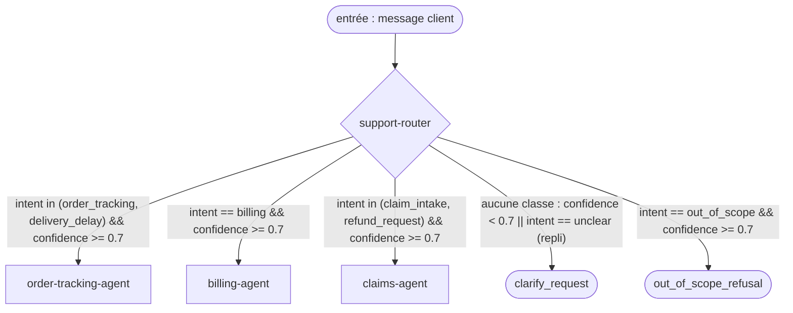

# TOPOLOGY: 1-SupportDesk

MISSION: 1-SupportDesk
MISSION hash: sha256:ece96883
Status: Architected
Root Pattern: router

> Matérialisation du roster déclaré par l'architecte
> (`workspace/feats/topology/1-roster.md`, validé par `roster validate`). Aucun
> agent n'y est ajouté, retiré, renommé ni re-scopé (P7). Les écarts constatés
> sont **signalés au §10, pas corrigés**.

---

## 1. Allocation des capabilities

| CAP | Portée par | Pourquoi là et pas ailleurs |
|---|---|---|
| 1-1-RouteIntent | agent `support-router` (aucun outil) | jugement sur du langage naturel : intention ambiguë, paraphrases, injection directe dans le message. Aucun outil déterministe ne classe un message libre en 7 classes avec une confiance. |
| 1-2-TrackOrder | agent `order-tracking-agent` + outils `orders_lookup`, `shipments_lookup` (`orders_search` câblé par le roster, cf. §10 W3) | la LECTURE est déterministe (outils générés) ; la rédaction factuelle bornée par BR-2/BR-13 et le refus de suivre `delivery_note` sont un jugement sur du texte. |
| 1-3-ExplainDelay | agent `order-tracking-agent` + outils `orders_lookup`, `shipments_lookup` | la **qualification du retard (BR-3) est un calcul déterministe** (`as_of` vs `promised_delivery_date` + état de livraison) : un outil suffirait (§10 W5). Reste au modèle : citer `delay_reason`, citer `carrier_message` sans y obéir. |
| 1-4-AnswerBilling | agent `billing-agent` + outils `invoices_search`, `payments_search`, `orders_lookup` | lecture déterministe ; l'explication par statut (pending / failed / non facturée) et le choix TTC/HT selon la demande sont un jugement sur la question. |
| 1-5-QualifyClaim | agent `claims-agent` + outils `claims_search`, `refunds_search`, `orders_lookup`, `shipments_lookup` | la détection de doublon (BR-5) est déterministe sur `claims`/`refunds` ; qualifier le motif depuis la description libre du client et rédiger le `claim_request` exigent un jugement. |
| 1-6-AssessRefund | agent `claims-agent` + outils `orders_lookup`, `shipments_lookup`, `refunds_search`, `claims_search` | **l'éligibilité BR-8 est une table de décision déterministe** sur des champs structurés (statut, dates, `delay_reason`) : un outil suffirait (§10 W5). Reste au modèle : distinguer question de politique / demande concrète (AC-4), extraire le motif (manquant/endommagé → `needs_review`). |

Retrievers : **aucun** (`## Active RAG Pattern` = none).
Outils générés non alloués : `customers_lookup`, `customers_search`, et tous les
`*_count` — aucune CAP ne les exige (moindre privilège).

> Rappel : **un outil déterministe bat un agent sur tous les critères** — coût,
> latence, testabilité, débogabilité. Pour chaque CAP confiée à un agent,
> l'absence d'alternative outil doit être un constat, pas un oubli. Ici elle
> n'en est pas un pour BR-3 et BR-8 : signalé §10 W5.

---

## 2. Roster — renvoi à la source unique

> **Source unique : `workspace/feats/topology/1-roster.md`** (écrit par
> l'architecte, validé par `roster validate`). Il n'est pas recopié ici : deux
> déclarations, et c'est celle que personne ne relit qui gouverne le code
> (`[ARCH_ROSTER_DUPLICATE_SOURCE]`). Cette topologie le matérialise sans en
> modifier aucune ligne — orchestrateur `support-router` (fast), spécialistes
> `order-tracking-agent`, `billing-agent`, `claims-agent` (balanced), 5
> relations, `loop_bounds: []`, pas de stratégie de fusion (pattern `router`).

---

## 3. Alternative plus simple considérée

> **Section consultative.** L'architecture appartient à l'architecte ; cette
> section chiffre le choix, elle ne le négocie pas.

**Topologie envisagée à N-1 agents** :
`support-router` (fast) + **deux** spécialistes `balanced` : un spécialiste
« consultation » fusionnant `order-tracking-agent` et `billing-agent` (outils
`orders_lookup`, `orders_search`, `shipments_lookup`, `invoices_search`,
`payments_search` — 5 outils read-only, 8 règles) et `claims-agent` inchangé.
Envisagé aussi, à 1 agent : `single-agent` `balanced` portant les 7 outils
distincts (≤ 8, dans le domaine d'usage de `single-agent`).

**Ce qui la disqualifie** :
- *À 3 agents (fusion suivi + facturation)* : **rien de mesuré.** Coût estimé
  +$0.004/run sur les branches suivi/facturation (prompt de base ~3 450 tokens
  au lieu de ~2 300, deux tours), −1 contrat, −1 prompt, −1 eval isolée. Le
  roster invoque la dégradation de la sélection d'outils : c'est le signal
  d'escalade du catalogue, mais il exige une **matrice de confusion mesurée**,
  qui n'existe pas encore. Écart de coût faible dans les deux sens : le choix
  de l'architecte est tenable, il n'est pas prouvé.
- *À 1 agent* : plus cher en nominal (~$0.038/run contre $0.023–$0.033 :
  prompt de base ~4 750 tokens à chaque tour, et la clarification / le refus
  payés en `balanced` au lieu de `fast` : ~$0.015 contre $0.002), mais plus
  rapide d'un hop (~0.8 s) et sans risque de misroute. Écarté par le pattern
  imposé dans `STACK.md` (`router`), dont c'est la raison d'être : isoler la
  branche remboursement (misroute interdit, CAP 1-1 AC-2).

**Raison invoquée par agent au-delà du premier** — liste close de P7 :

| Agent | Raison invoquée | Élément de preuve |
|---|---|---|
| `support-router` | tier de modèle distinct | classification `fast` (in ~1 000 / out ~60 tokens, $0.0013) vs spécialistes `balanced` ; repli clarify/refus à $0.002 au lieu de ~$0.015 en `balanced` |
| `billing-agent` | **aucune raison de la liste close ne s'applique en MISSION 1** → `[TOPOLOGY_SIMPLICITY_ADVISORY]` | même tier (`balanced`) ; outils tous read-only (raison 1 sans objet) ; prompt combiné estimé ~6–7 k tokens, loin de la fenêtre (raison 3 non mesurée) ; pas de critique (4) ; pas de parallélisme (5). Coût de la séparation vs fusion : −$0.004/run en sa faveur, +1 contrat/prompt/eval. |
| `claims-agent` | **aucune raison de la liste close ne s'applique en MISSION 1** → `[TOPOLOGY_SIMPLICITY_ADVISORY]` | même constat ; l'argument du roster (branche où l'erreur coûte de l'argent, évaluable seule) relève de l'évaluabilité, hors liste close. **Deviendra la raison 1 en MISSION 2** : les outils `create_claim` / `request_refund` (write-scoped, `support-actions`) ne devront pas cohabiter avec les contextes de suivi exposés à `carrier_message`. |

`order-tracking-agent` n'y figure pas : c'est l'agent de base, celui qu'un
`single-agent` aurait eu seul.

> « Séparation des responsabilités » n'est pas recevable. Les deux avis
> ci-dessus sont des avertissements : ils ne bloquent pas, et le roster reste
> celui de l'architecte.

---

## 4. Le graphe

> Le bloc ci-dessous EST le graphe : c'est lui que `ir-compiler` lit, et son
> hash est celui de ce fichier. Aucun fichier `.mmd` à côté.



- **Nœud d'entrée** : `entry`
- **Nœuds terminaux** : `order-tracking-agent`, `billing-agent`, `claims-agent`, `clarify_request`, `out_of_scope_refusal`
- **maxHops** : 2
- **Cycles** : aucun. Aucun spécialiste ne revient vers le routeur (un routeur
  qui reroute est un superviseur déguisé, `router.md §5`). La reprise après
  clarification est un **nouveau run** (tour suivant, reclassé depuis le début
  avec l'historique), pas une arête.
- **Chemin de repli** : `support-router → clarify_request` quand aucune classe
  n'atteint le seuil (`confidence < 0.7`) ou `intent == unclear` : une question
  de clarification, aucun spécialiste appelé. `clarify_request` et
  `out_of_scope_refusal` sont des **sorties du routeur**, pas des agents (roster).

---

## 5. Budget estimé

> **HYPOTHÈSE** (ARCHITECTURE §5) : estimé à la main sur le graphe, avant l'IR.
> Le fait viendra de `python .sdda/sdda.py estimate-budget --mission 1` sur l'IR
> compilé ; s'il contredit ce tableau, c'est lui qui a raison.
>
> Hypothèses de calcul : `fast` = claude-haiku-4-5, `balanced` = claude-sonnet-5
> (`## Runtime Models`) ; prix **supposés** $1/$5 et $3/$15 par Mtok in/out (la
> table de prix du provider n'est pas dans mon contexte) ; aucun cache de
> prompt ; routeur ~900 tokens de prompt ; spécialiste ~1 400–1 800 tokens de
> prompt + ~250 tokens par schéma d'outil ; résultat d'outil ~500 tokens
> (fichiers < 2 Ko) ; appels d'outils émis en parallèle dans un même tour ;
> latence : TTFT 0.4 s / 0.7 s, débit 150 / 80 tokens/s (fast / balanced),
> lecture locale < 50 ms.

| Chemin | Appels LLM | Tokens estimés | Coût estimé | Latence estimée |
|---|---:|---:|---:|---:|
| repli (clarify / out_of_scope) | 1 | 1 120 | $0.002 | 1.0 s |
| politique générale (1-6 AC-4, sans outil) | 2 | 4 210 | $0.013 | 4.0 s |
| nominal suivi / retard (2 outils, 2 tours) | 3 | 7 040 | $0.023 | 6.1 s |
| nominal facturation (3 outils, 2 tours) | 3 | 7 580 | $0.025 | 6.3 s |
| nominal réclamation / remboursement (4 outils, 2 tours) | 3 | 9 600 | $0.033 | 8.8 s |
| pire cas (historique 12 tours, `claims-agent` à `max_iterations` = 2, `max_tool_calls` = 4) | 3 | 11 520 | $0.036 | 9.6 s |

Bornes des spécialistes resserrées par décision de l'architecte sur G2.budget :
`max_iterations` 6 → 2, `max_tool_calls` 8 → 4 (routeur inchangé : 1 / 0).

**Fait** (`estimate-budget` sur l'IR compilé, qui fait foi) : nominal
**$0.016 / 10 155 ms**, pire cas **$0.030 / 19 055 ms** sur
`entry → support-router → billing-agent` (54 700 ms avant resserrement).
L'écart avec l'estimation manuelle (9.6 s) vient du modèle de latence du
script, que je n'ai pas lu. Hypothèse, non vérifiée : il compte la latence des
outils en série et à leur délai maximal (`SourceReadTimeoutMs` = 3 000 ms).

- Budget MISSION : cible **$0.03** / plafond dur **$0.15** / p95 **6 000 ms** / **30 000 tokens**
- Verdict coût : 🟢 pire cas $0.030 (script) / $0.036 (manuel) < plafond $0.15.
  🟡 nominal réclamation $0.033 > cible $0.03 (manuel ; le script donne $0.016
  en nominal).
- Verdict tokens : 🟢 pire cas 11 520 < 30 000 ; le plafond de tokens n'est plus
  la borne active.
- Verdict latence : 🔴 **toujours au-dessus de la cible, y compris en nominal**
  (script : 10.2 s nominal, 19.1 s pire cas ; manuel : 6.1 à 9.6 s). **Aucune
  borne d'agent ne ramène le run sous 6 s** : à `max_iterations = 2`, un
  spécialiste fait déjà le minimum (un tour de lecture, un tour de réponse), et
  `max_iterations = 1` l'empêcherait de lire avant de répondre. Leviers
  restants, à l'architecte : (a) si l'hypothèse ci-dessus est juste,
  `SourceReadTimeoutMs` (3 000 ms pour des fichiers locaux de quelques Ko) et/ou
  `max_tool_calls` compté par tour d'appels parallèles ; (b) plafond de tokens
  de sortie par tour ; (c) tier `fast` pour `order-tracking-agent` /
  `billing-agent` (roster) ; (d) renégocier `LatencyP95TargetMs` dans la
  MISSION. Aucun n'est appliqué ici.

---

## 6. Contrats produits

| Type | Fichier |
|---|---|
| agent | `workspace/feats/contracts/agents/1-support-router.agent.md` |
| agent | `workspace/feats/contracts/agents/1-order-tracking-agent.agent.md` |
| agent | `workspace/feats/contracts/agents/1-billing-agent.agent.md` |
| agent | `workspace/feats/contracts/agents/1-claims-agent.agent.md` |
| tool | `workspace/feats/contracts/tools/1-orders-lookup.tool.md` |
| tool | `workspace/feats/contracts/tools/1-orders-search.tool.md` |
| tool | `workspace/feats/contracts/tools/1-shipments-lookup.tool.md` |
| tool | `workspace/feats/contracts/tools/1-invoices-search.tool.md` |
| tool | `workspace/feats/contracts/tools/1-payments-search.tool.md` |
| tool | `workspace/feats/contracts/tools/1-claims-search.tool.md` |
| tool | `workspace/feats/contracts/tools/1-refunds-search.tool.md` |
| retrieval | aucun |
| memory | `workspace/feats/contracts/memory/1-memory.md` |

> Outils : générés depuis `## Active Data Sources` (declared-sources), read-only,
> filtre `customer_id` imposé par le runtime ; seuls les 7 alloués sont listés,
> aucun outil hors données. Retrieval : `rag/none`. Mémoire : buffer 12 tours,
> lu par le routeur seul ; état inter-agents `{intent, confidence, entities}`.
> Aucun contrat `data` séparé : l'enveloppe vit dans les contrats d'outils générés
> et dans `STACK.md`.

---

## 7. Handoffs

| De | Vers | Condition | État transmis | Retour attendu |
|---|---|---|---|---|
| `support-router` | `order-tracking-agent` | `intent in (order_tracking, delivery_delay) && confidence >= 0.7` | `{message, intent, confidence, entities: {order_id?}, as_of}` ; `customer_id` reste dans le contexte runtime (filtre des outils), jamais fourni par le modèle | `{behavior: answer\|not_found, status?, carrier?, last_scan?, estimated_delivery_date?, preparation_status?, promised_date?, is_delayed?, delay_reason?, carrier_message_quoted?, sources[], degraded}` |
| `support-router` | `billing-agent` | `intent == billing && confidence >= 0.7` | `{message, intent, confidence, entities: {order_id?, invoice_id?}, as_of}` ; `customer_id` runtime | `{behavior: answer\|not_found, invoice_number?, amount_ttc?, amount_ht?, vat?, payment_status?, due_date?, failure_reason?, card_last4?, sources[], degraded}` |
| `support-router` | `claims-agent` | `intent in (claim_intake, refund_request) && confidence >= 0.7` | `{message, intent, confidence, entities: {order_id?, claim_id?}, as_of}` ; `customer_id` runtime | `{behavior: answer\|clarify\|refuse, claim_request?, eligibility?, existing_status?, policy_answer?, sources[], degraded}` |
| `support-router` | `clarify_request` | `confidence < 0.7 \|\| intent == unclear` (repli) | — (sortie du routeur) | `{behavior: clarify, clarification_question, thread_id}` |
| `support-router` | `out_of_scope_refusal` | `intent == out_of_scope && confidence >= 0.7` | — (sortie du routeur) | `{behavior: refuse, refusal_message, thread_id}` |

> `message` est l'entrée du run, pas un produit du routeur : le roster
> (« {intent, confidence, entities} et rien d'autre ») limite ce que le routeur
> **ajoute** ; l'historique de conversation, lui, n'est **pas** transmis aux
> spécialistes (lecture de conversation réservée au routeur).

---

## 8. Imbrication de patterns

Profondeur : 1 (aucune imbrication).

- Racine : `router`
- Imbriqué : aucun. Chaque spécialiste est une boucle agent + outils bornée
  (`max_iterations`, `max_tool_calls`), pas un pattern imbriqué.

---

## 9. Décisions à ADR

- Choix du pattern racine `router` : décision de l'architecte, motivée dans
  `STACK.md ## Active Orchestration Pattern` et dans le roster. ADR à rédiger
  par l'architecte s'il doit survivre à la MISSION 1 — non rédigé ici : je ne
  consigne pas à sa place une décision qu'il a prise.
- Aucun pattern refusé par défaut, aucun accès en écriture, `MemoryPIIPolicy:
  redact-before-write`, `DbAgentRole` sans objet : rien d'autre à ADR.

---

## 10. Écarts signalés (non corrigés)

```
WARN: agent architect-topology — taxonomie d'intention divergente
CAUSE: [CAP_GAP] CAP 1-1 déclare les classes (tracking, delay, billing, payment,
       claim_intake, refund_request, out_of_scope) ; le roster route sur
       (order_tracking, delivery_delay, billing, claim_intake, refund_request,
       out_of_scope, unclear) — `payment` n'existe pas au roster, `unclear`
       n'existe pas dans la CAP, et les noms diffèrent
FIX: aligner l'un sur l'autre — /sdda-caps 1 (enum de 1-1 et du golden
     route-intent-v1) ou 1-roster.md — avant que qa-evals ne labellise le golden
```
(Taxonomie : pas de classe dédiée à « CAP vs roster divergents » ; `[CAP_GAP]`
est la plus proche. Les contrats utilisent l'enum du roster, qui porte les
conditions de routage.)

```
WARN: agent architect-topology — agents au-delà du premier sans raison P7
CAUSE: [TOPOLOGY_SIMPLICITY_ADVISORY] billing-agent et claims-agent : aucune
       des 5 raisons closes ne s'applique en MISSION 1 (même tier, outils tous
       read-only, pression de contexte non mesurée) ; fusion suivi+facturation
       estimée à +$0.004/run ; roster à 4 agents = MaxAgentsWarnAt (4), à la
       limite sans la dépasser
FIX: aucun requis — l'architecte assume ou fusionne dans 1-roster.md ; mesurer
     la matrice de confusion des appels d'outils en G5 pour étayer le choix
```

```
WARN: agent architect-topology — outil câblé sans CAP qui l'exige
CAUSE: [TOOL_SCOPE_EXCESS] order-tracking-agent porte orders_search ; CAP 1-2 et
       1-3 prennent order_id en entrée obligatoire et BR-12 interdit de deviner
       une commande — orders_lookup suffit à toutes leurs AC
FIX: retirer orders_search du roster, ou ajouter à 1-2 l'AC qui l'exige
     (ex. « lister mes commandes en cours ») via /sdda-caps 1 --append
```

```
WARN: agent architect-topology — budget de latence dépassé à l'estimation
CAUSE: [BUDGET_EXCEEDED_ESTIMATE] p95 cible 6 000 ms ; après resserrement des
       spécialistes (max_iterations 2, max_tool_calls 4), estimate-budget donne
       nominal 10 155 ms et pire cas 19 055 ms (était 54 700 ms) ; coût tenu
       ($0.030 < $0.15)
FIX: aucune borne d'agent ne suffit : l'architecte choisit entre
     SourceReadTimeoutMs / comptage des outils parallèles, plafond de tokens de
     sortie, tier fast sur suivi/facturation, ou cible p95 renégociée dans la MISSION
```

```
WARN: agent architect-topology — calcul déterministe confié à un agent
CAUSE: [CAP_GAP] BR-3 (retard) et BR-8 (éligibilité) sont des calculs sur champs
       structurés, portés par order-tracking-agent (1-3) et claims-agent (1-6) ;
       STACK.md ## Active Architecture Pattern annonce ces règles « exposées en
       outils » depuis app/domain/, mais ## Active Tools & Integrations est vide
FIX: déclarer deux outils déterministes (qualification du retard, éligibilité
     BR-8) dans ## Active Tools & Integrations puis relancer /sdda-topology 1 ;
     sinon assumer le jugement LLM sur une table de décision
```

```
WARN: agent architect-topology — clause de CAP sans outil pour l'atteindre
CAUSE: [CAP_GAP] CAP 1-5 Failure Behavior traite `customers.notes` comme entrée
       non maîtrisée, mais aucun agent n'a d'outil customers_* (roster)
FIX: retirer la clause de 1-5 via /sdda-caps 1, ou ajouter customers_lookup à
     claims-agent dans 1-roster.md si une AC l'exige
```
